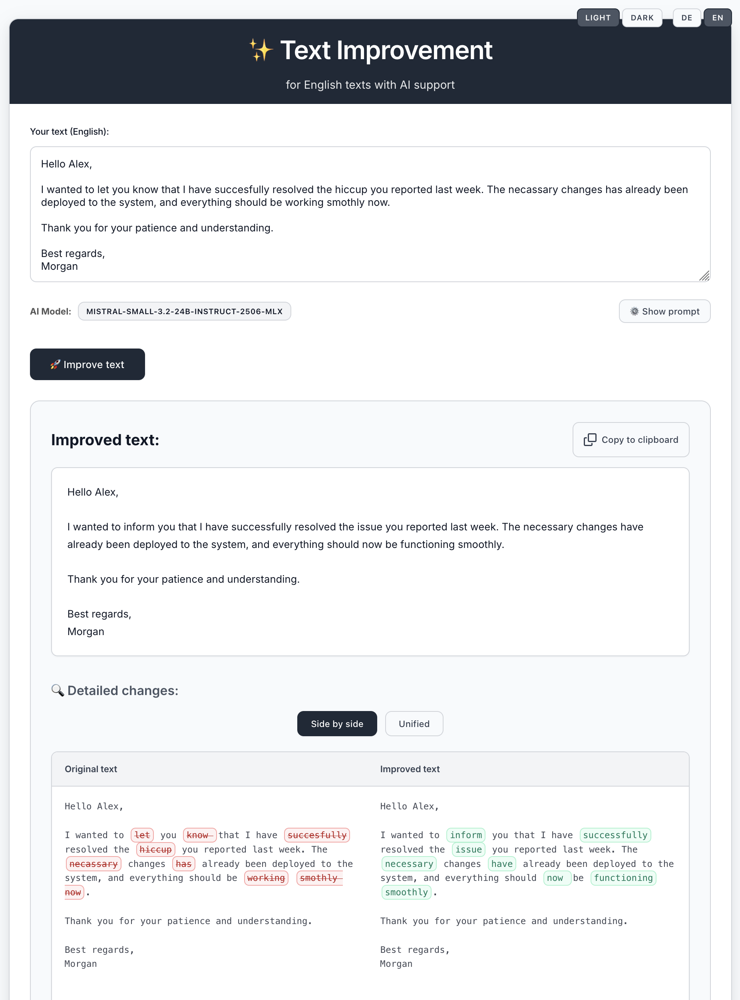

# Text Improvement Application

[](https://opensource.org/licenses/Apache-2.0)
[](https://openjdk.java.net/)
[](https://spring.io/projects/spring-boot)

A Spring Boot application that uses AI models to improve German text with visual diff comparison.



## 🌟 Features

- **AI-powered text improvement** for German and English language
- **Model selection** from OpenAI-compatible API servers  
- **Visual diff comparison** showing word-level changes
- **Custom prompt editing** for advanced users
- **Secure implementation** with XSS protection and input validation
- **Smart model preselection** (prefers Mistral > Gemma > alphabetical)

## 🚀 Quick Start

```bash
# Clone the repository
git clone https://github.com/shuhle/txtimprove.git
cd txtimprove

# Start your AI server (e.g., LM Studio on localhost:1234)

# Run the application
mvn spring-boot:run

# Open in browser
open http://localhost:8080
```

## 💡 How It Works

1. **Enter Text**: Input German text that needs improvement (emails, documents, etc.)
2. **Select Model**: Choose from available AI models detected from your server
3. **Customize Prompt**: Optionally modify the AI prompt for specific requirements
4. **Get Results**: View improved text with character-level diff highlighting changes
5. **Compare**: See exactly what was changed with visual diff comparison

## Configuration

The application can be configured using environment variables:

### Environment Variables

| Variable | Default | Description |
|----------|---------|-------------|
| `OPENAI_API_KEY` | `not-needed` | API key for OpenAI-compatible server |
| `OPENAI_BASE_URL` | `http://localhost:1234/` | Base URL of OpenAI-compatible server |
| `DEFAULT_MODEL` | `local-model` | Fallback model name |
| `AI_TEMPERATURE` | `0.1` | AI model temperature (0.0-2.0, lower = more deterministic) |
| `CACHE_MODEL_DISCOVERY_DURATION_MINUTES` | `5` | Duration in minutes to cache model discovery results |

### Example Configuration

```bash
export OPENAI_BASE_URL="http://your-server:8080/"
export OPENAI_API_KEY="your-api-key"
export DEFAULT_MODEL="your-preferred-model"
export AI_TEMPERATURE="0.3"
export CACHE_MODEL_DISCOVERY_DURATION_MINUTES="10"
```

## Running the Application

### Prerequisites

- Java 21 or later
- Maven 3.6+
- OpenAI-compatible AI server (e.g., LM Studio, Ollama, etc.)

### Local Development

1. Start your AI server (e.g., LM Studio on localhost:1234)
2. Run the application:
   ```bash
   mvn spring-boot:run
   ```
3. Open http://localhost:8080

### Production Deployment

1. Set environment variables:
   ```bash
   export OPENAI_BASE_URL="https://your-ai-server.com/"
   export OPENAI_API_KEY="your-secure-api-key"
   ```
2. Build and run:
   ```bash
   mvn clean package
   java -jar target/txtimprove-0.0.1-SNAPSHOT.jar
   ```

## Security Features

- Input length validation (10,000 chars for text, 5,000 for prompts)
- XSS protection with safe DOM manipulation
- Subresource Integrity for external dependencies
- Cookie-only session tracking
- Error message sanitization

## 📝 License

Licensed under the Apache License 2.0. See [LICENSE](LICENSE) file for details.

## 🙏 Acknowledgments

- [Spring AI](https://docs.spring.io/spring-ai/reference/) for AI integration
- [jsdiff](https://github.com/kpdecker/jsdiff) for visual diff functionality
- [Thymeleaf](https://www.thymeleaf.org/) for templating
